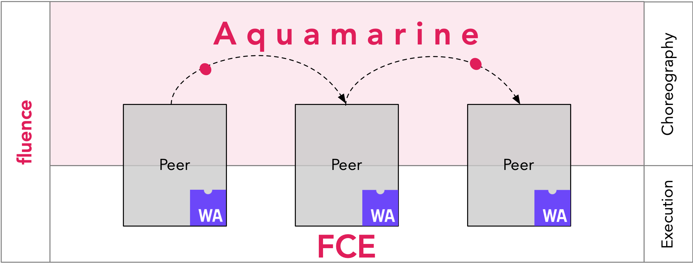

# Fluence network environment

[](https://www.npmjs.com/package/@fluencelabs/fluence-network-environment)

Officially maintained list of well-known Fluence network nodes. The package is meant to be used in combination with [Fluence JS SDK](https://github.com/fluencelabs/fluence-js).

## Installation

With npm

```bash
npm install @fluencelabs/fluence-network-environment
```

With yarn

```bash
yarn add @fluencelabs/fluence-network-environment
```

## Usage

Pick a node to connect to the Fluence network.

```typescript
import { dev } from '@fluencelabs/fluence-network-environment';

export const relayNode = dev[0];
```

Which can be used to initialize the Fluence client (see [Fluence JS SDK](https://github.com/fluencelabs/fluence-js).)

```typescript
import { createClient } from '@fluencelabs/fluence';

const client = await createClient(relayNode);
```

## Known networks

### dev

**Unstable** Several nodes running on the same physical host. Used a lot to test things out. 

### stage

Environment primarily used for staging deployments of various Fluence services.

### FaaS Net

The main Fluence network. It consists of a ten nodes each running on a separate physical host.


## About Fluence

Fluence is an open application platform where apps can build on each other, share data and users

|         Layer         |                             Tech                             |              Scale               |               State               |                           Based on                           |
| :-------------------: | :----------------------------------------------------------: | :------------------------------: | :-------------------------------: | :----------------------------------------------------------: |
|       Execution       |          [FCE](https://github.com/fluencelabs/fce)           |           Single peer            | Disk, network, external processes | Wasm, [IT](https://github.com/fluencelabs/interface-types), [Wasmer\*](https://github.com/fluencelabs/wasmer) |
|      Composition      |   [Aquamarine](https://github.com/fluencelabs/aquamarine)    |          Involved peers          |      Results and signatures       |                        ⇅, π-calculus                         |
|       Topology        | [TrustGraph](https://github.com/fluencelabs/fluence/tree/master/trust-graph), [DHT\*](https://github.com/fluencelabs/rust-libp2p) | Distributed with Kademlia\* algo |    Actual state of the network    |       [libp2p](https://github.com/libp2p/rust-libp2p)        |
| Security & Accounting |                          Blockchain                          |          Whole network           |        Licenses & payments        |                          substrate?                          |




## License

[Apache 2.0](https://github.com/fluencelabs/fluence/blob/trustless_computing/LICENSE.md)